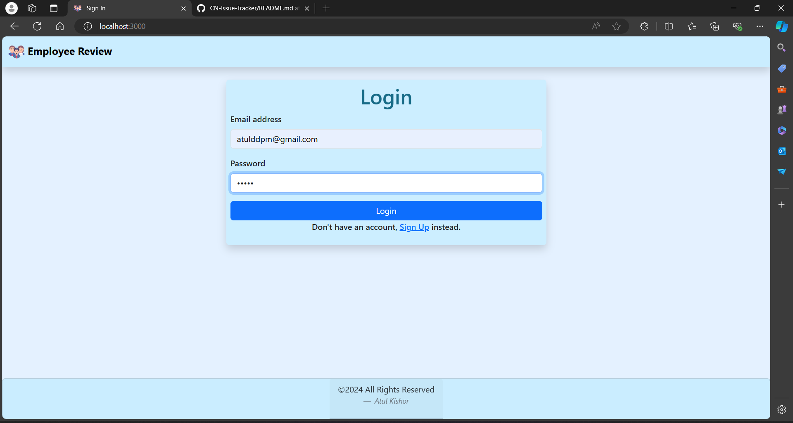
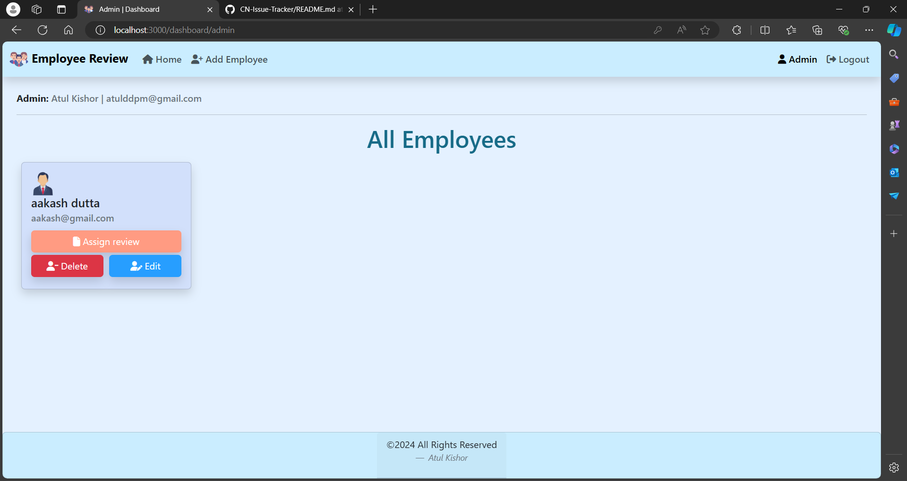
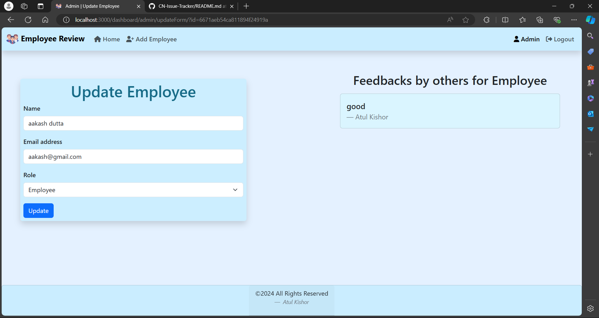

# Employee Review System
  This is an Employee Review System (ERS) project of Coding Ninjas made using Nodejs, Expressjs in backend. MongoDB is used for database and EJS is used for frontend. Any user can create their account with role either admin or employee. Both Admin and Employee is given different task.
  Admin can add, remove or update any user's data. Employee can give their feedback on other employees.

## Hosted link:

https://cn-employee-review-system-43s6.onrender.com/
Username: aakash@gmail.com
Password (all): qwerty

# ScreenShots:
  ## Login page:
  

  ## Admin Dashboard:
  

  ## Employee Dashboard:
  

  ## Admin can update and view all reviews of an employee:
  

# Installation and Run 
1. **Clone the repository**
    ```bash
    git clone https://github.com/AtulKishor/CN-Employee-review-system.git
    ```

2. **Navigate to the project directory**
    ```bash
    cd CN-Employee-review-system
    ```

3. **Install the dependencies**
  Follow these steps:
  - Get the code on your system.
  - Open terminal on your pc and navigate to the root directory of the project.
  - Run "npm install" command inside the terminal to install all the required dependencies.
  - Create a '.env' file inside root directory and define values for
      - PORT ( port on which your project will run )
      - MONGODB_URL ( URL of your mongoDB database for connecting to database )
      - SECRET_KEY ( secret key for express-session )
  - Run 'npm start' command inside terminal to run the code.
  - Open your web browser and goto 'localhost:{PORT}/' to see the output.

# Features
  - Create account with your role as "Admin" or "Employee".
  - An employee can register, only admin can make an employee an admin
  - Store all the data of employee, reviews in database.
  ## Admin view
    - Add/remove/update/view employees by admin.
    - Add/update/view performance reviews 
    - Assign employees to participate in another employee's performance review
  ## Employee view
    - List of performance review requiring feedback
    - Submit feedback
  
# Tools used:
  - Nodejs
  - Expressjs
  - Mongoose
  - EJS
  - Passport
  - Passport local
  - BootStrap

